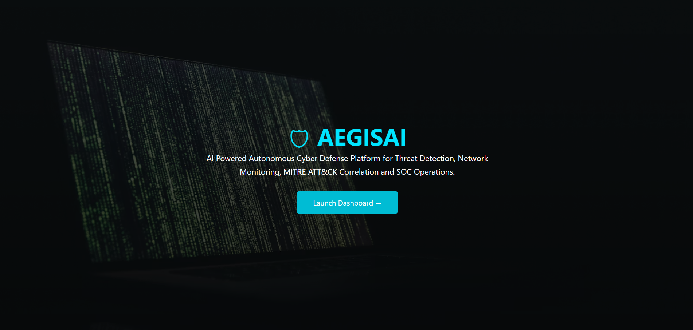
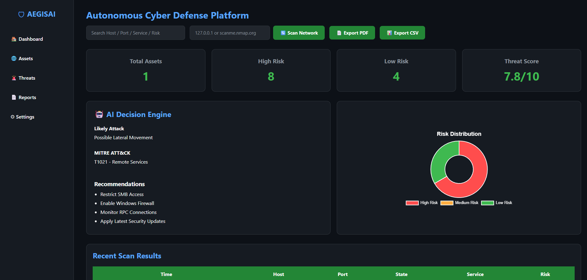
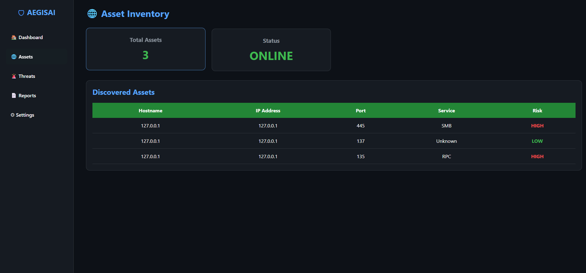
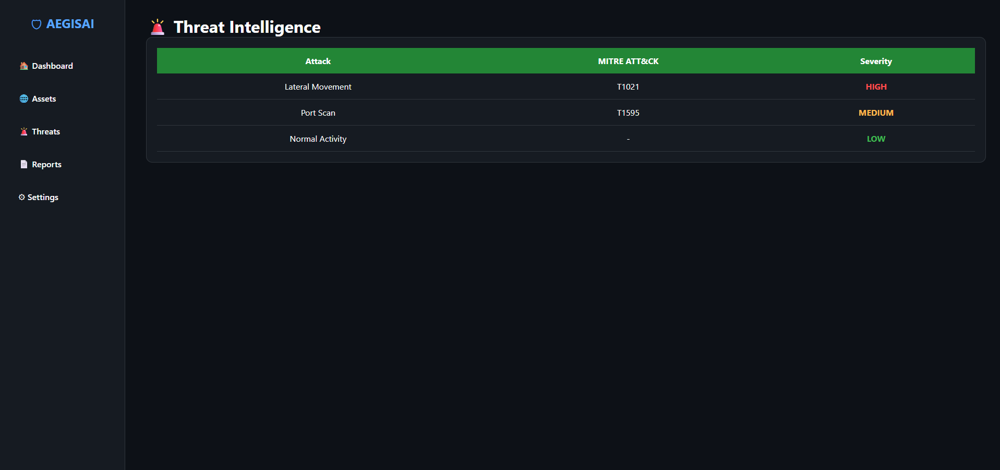
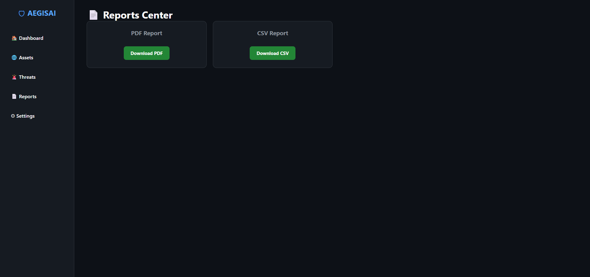

# 🛡️ AEGISAI – AI Powered Autonomous Cyber Defense Platform

<p align="center">
  
  
  
  
  
</p>

---

# 🚀 Overview

AEGISAI is an AI-powered autonomous cyber defense platform built to simulate the workflow of a modern Security Operations Center (SOC).

The platform performs:

- Network Asset Discovery
- Port & Service Detection
- AI Threat Correlation
- MITRE ATT&CK Mapping
- Risk Classification
- Dashboard Visualization
- Report Generation (PDF & CSV)
- Asset Inventory
- Threat Monitoring

Designed using Python, Flask, SQLite and Nmap, AEGISAI demonstrates real-world SOC analyst skills and cybersecurity automation.

---

# ✨ Features

- AI Threat Detection Engine
- MITRE ATT&CK Mapping
- Intelligent Risk Scoring
- Network Scanner
- Asset Discovery
- Dashboard Analytics
- Search Functionality
- Export Reports (PDF)
- Export Reports (CSV)
- Threat Dashboard
- Asset Inventory
- Landing Page
- Modern Dark UI

---

# 🖥 Screenshots

## 🏠 Landing Page



---

## 📊 Dashboard



---

## 🌐 Assets



---

## 🚨 Threat Detection



---

## 📄 Reports



---

# 🏗 Project Architecture

```
                    +----------------------+
                    |    Landing Page      |
                    +----------+-----------+
                               |
                               v
                    +----------------------+
                    | Flask Dashboard      |
                    +----------+-----------+
                               |
         +---------------------+----------------------+
         |                     |                      |
         v                     v                      v
+----------------+     +----------------+     +----------------+
| Network Scanner|     | Threat Engine  |     | Risk Engine    |
+----------------+     +----------------+     +----------------+
         |                     |                      |
         +----------+----------+----------------------+
                    |
                    v
             +---------------+
             | SQLite DB     |
             +---------------+
                    |
          +---------+----------+
          |                    |
          v                    v
     PDF Reports         CSV Reports
```

---

# ⚙ Technology Stack

| Category | Technology |
|----------|------------|
| Language | Python |
| Backend | Flask |
| Database | SQLite |
| Scanner | Nmap |
| Charts | Chart.js |
| Frontend | HTML CSS JavaScript |
| Reporting | ReportLab |
| Threat Mapping | MITRE ATT&CK |

---

# 📂 Project Structure

```
AEGISAI
│
├── analyzer
├── collector
├── dashboard
├── database
├── data
├── reports
├── screenshots
├── main.py
└── README.md
```

---

# 🚀 Installation

## 1. Clone the repository

```bash
git clone https://github.com/ManikandanF1/AEGISAI.git
```

## 2. Navigate to the project

```bash
cd AEGISAI
```

## 3. Install the required dependencies

```bash
pip install flask fastapi uvicorn jinja2 python-nmap reportlab requests pandas matplotlib scikit-learn
```

## 4. Run the application

> Run the application from the project root using the module command.

```bash
python -m dashboard.app
```

## 5. Open your browser

```
http://127.0.0.1:5000
```

# 📈 Future Enhancements

- Live Alerts
- CVE Integration
- Email Notifications
- Authentication
- Multi-user Support
- SIEM Integration
- AI Incident Response
- Docker Deployment
- Cloud Deployment

---

# 👨‍💻 Developer

**Manikandan G**

Cyber Security | SOC Analyst | Python Developer

LinkedIn

https://www.linkedin.com/in/manikandan-giri-

GitHub

https://github.com/ManikandanF1

---

# ⭐ Support

If you like this project,

⭐ Star this repository

🍴 Fork this repository

📢 Share with your friends

---

# 📜 License

MIT License

Copyright (c) 2026 Manikandan G

Permission is hereby granted, free of charge, to any person obtaining a copy of this software and associated documentation files (the "Software"), to deal in the Software without restriction.
